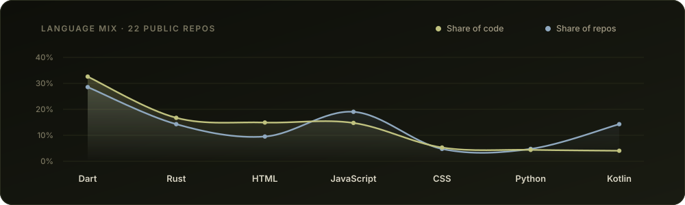

<picture>
  <source media="(prefers-color-scheme: dark)" srcset="./assets/banner-dark.svg">
  <source media="(prefers-color-scheme: light)" srcset="./assets/banner-light.svg">
  
</picture>

  &nbsp;&nbsp;
  &nbsp;&nbsp;
  &nbsp;&nbsp;
  &nbsp;&nbsp;
  

Self-taught full-stack developer and designer. I like owning the whole thing —
Rust on the backend, Flutter and TypeScript on the front, and my own design work
rather than handing it off.

My favourite language is Rust, which probably tells you more about me than the rest
of this page does.

## Now

<!-- Keep this to 2-3 things you are actually touching this month. -->

- <a href="https://github.com/SabbirMurad/bento"><picture><source media="(prefers-color-scheme: dark)" srcset="./assets/names/bento-dark.svg"></picture></a> — a Chrome new tab page you arrange yourself. Clock, bookmarks, shortcuts and search are pieces you move, restyle or switch off; nothing is fixed in place. Manifest V3, no build step, no dependencies.
- <a href="https://github.com/SabbirMurad/postura_app"><picture><source media="(prefers-color-scheme: dark)" srcset="./assets/names/postura-dark.svg"></picture></a> — posture detection that runs on the phone. Flutter shell over a native Kotlin MediaPipe engine, with a <a href="https://github.com/SabbirMurad/postura_backend"><picture><source media="(prefers-color-scheme: dark)" srcset="./assets/names/python-backend-dark.svg"></picture></a> behind it.
- <a href="https://github.com/SabbirMurad/fireball"><picture><source media="(prefers-color-scheme: dark)" srcset="./assets/names/fireball-dark.svg"></picture></a> — hand landmarks tracked live on the camera feed, 21 points drawn straight onto the preview. Close your fist and open it and a fireball appears in your palm.

## Selected work

| Project | What it is | Built with |
| :--- | :--- | :--- |
| <a href="https://github.com/SabbirMurad/bento"><picture><source media="(prefers-color-scheme: dark)" srcset="./assets/names/bento-dark.svg"></picture></a> | Fully rearrangeable Chrome new tab page | JavaScript · MV3 |
| <a href="https://github.com/SabbirMurad/fireball"><picture><source media="(prefers-color-scheme: dark)" srcset="./assets/names/fireball-dark.svg"></picture></a> | Real-time hand tracking, Flutter shell bridged to a native ML engine | Flutter · Kotlin · MediaPipe |
| <a href="https://github.com/SabbirMurad/postura_app"><picture><source media="(prefers-color-scheme: dark)" srcset="./assets/names/postura-dark.svg"></picture></a> | On-device posture detection — app, <a href="https://github.com/SabbirMurad/posture_detector"><picture><source media="(prefers-color-scheme: dark)" srcset="./assets/names/engine-dark.svg"></picture></a> and <a href="https://github.com/SabbirMurad/postura_backend"><picture><source media="(prefers-color-scheme: dark)" srcset="./assets/names/backend-dark.svg"></picture></a> | Flutter · Kotlin · Python |
| <a href="https://github.com/SabbirMurad/scaffold"><picture><source media="(prefers-color-scheme: dark)" srcset="./assets/names/scaffold-dark.svg"></picture></a> | My starting point for a web service, hot reload and mkdocs docs wired up | Rust |
| <a href="https://github.com/SabbirMurad/fanari_v2"><picture><source media="(prefers-color-scheme: dark)" srcset="./assets/names/fanari-dark.svg"></picture></a> | Mobile app with its own <a href="https://github.com/SabbirMurad/fanari_backend"><picture><source media="(prefers-color-scheme: dark)" srcset="./assets/names/service-dark.svg"></picture></a> behind it | Flutter · Rust |
| <a href="https://github.com/SabbirMurad/portfolio"><picture><source media="(prefers-color-scheme: dark)" srcset="./assets/names/portfolio-dark.svg"></picture></a> | Source for <a href="https://sabbirhassan.com"><picture><source media="(prefers-color-scheme: dark)" srcset="./assets/names/sabbirhassan-com-dark.svg"></picture></a> | JavaScript |

## Stack

**Languages**

&nbsp;
&nbsp;
&nbsp;
&nbsp;
&nbsp;
&nbsp;
&nbsp;

**Frameworks &amp; runtime**

&nbsp;
&nbsp;
&nbsp;
&nbsp;
&nbsp;
&nbsp;

**Data &amp; infrastructure**

&nbsp;
&nbsp;
&nbsp;
&nbsp;
&nbsp;
&nbsp;
&nbsp;

**Design**

&nbsp;
![Photoshop](https://img.shields.io/badge/Photoshop-1B1D12?style=flat-square&logo=data%3Aimage/svg%2Bxml%3Bbase64%2CPHN2ZyB4bWxucz0iaHR0cDovL3d3dy53My5vcmcvMjAwMC9zdmciIHZpZXdCb3g9IjAgMCAxMjggMTI4Ij48cGF0aCBmaWxsPSIjMzFBOEZGIiBkPSJNMjIuNjY2IDEuNkMxMC4xMzMgMS42IDAgMTEuNzM0IDAgMjQuMjY4djc5LjQ2NEMwIDExNi4yNjYgMTAuMTMzIDEyNi40IDIyLjY2NiAxMjYuNGg4Mi42NjhjMTIuNTMzIDAgMjIuNjY2LTEwLjEzNCAyMi42NjYtMjIuNjY4VjI0LjI2OEMxMjggMTEuNzM0IDExNy44NjcgMS42IDEwNS4zMzQgMS42SDIyLjY2NnptMjMuMjAxIDMxLjczNGM0LjM3MyAwIDggLjUzMiAxMC45ODYgMS42NTJBMTkuMDUgMTkuMDUgMCAwIDEgNjQgMzkuMzYxYTE2Ljk3NiAxNi45NzYgMCAwIDEgMy44OTQgNi4wNzljLjggMi4yNCAxLjIyNSA0LjUzMyAxLjIyNSA2LjkzMyAwIDQuNTg3LTEuMDY2IDguMzczLTMuMiAxMS4zNi0yLjEzMiAyLjk4Ni01LjExOCA1LjIyNy04LjU4NSA2LjUwNy0zLjYyNyAxLjMzNC03LjYyNyAxLjgxMy0xMiAxLjgxMy0xLjI4IDAtMi4xMzUgMC0yLjY2OC0uMDUzLS41MzMtLjA1My0xLjI4LS4wNTMtMi4yOTMtLjA1M3YxNy4xMmMuMDUzLjM3My0uMjEzLjY5NC0uNTg2Ljc0N0gyOS40NGMtLjQyNiAwLS42MzgtLjIxNS0uNjM4LS42OTVWMzQuMjRjMC0uMzczLjE2LS41ODguNTMzLS41ODguOTA3IDAgMS43NiAwIDIuOTg2LS4wNTIgMS4yOC0uMDU0IDIuNjEzLS4wNTIgNC4wNTMtLjEwNiAxLjQ0LS4wNTMgMi45ODctLjA1NCA0LjY0LS4xMDcgMS42NTQtLjA1NCAzLjI1NC0uMDUzIDQuODU0LS4wNTN6bTEuMTkgMTAuNTA0YTE4LjY4IDE4LjY4IDAgMCAwLS44MTcuMDAyYy0xLjM4NiAwLTIuNjEzLjAwMS0zLjYyNy4wNTUtMS4wNjYtLjA1NC0xLjgxMi0uMDAxLTIuMTg1LjA1MnYxNy45MmMuNzQ2LjA1NCAxLjQzOC4xMDYgMi4wNzguMTA2aDIuODI4YzIuMDggMCA0LjE2LS4zMiA2LjEzMy0uOTYgMS43MDctLjQ4IDMuMi0xLjQ5NCA0LjM3My0yLjgyNyAxLjEyLTEuMzM0IDEuNjU0LTMuMTQ2IDEuNjU0LTUuNDkzYTguNzc2IDguNzc2IDAgMCAwLTEuMjI2LTQuNzQ2Yy0uOTA3LTEuMzg2LTIuMTg4LTIuNDU0LTMuNzM1LTMuMDQtMS43MjctLjctMy41NzYtMS4wMzMtNS40NzYtMS4wN3ptNDQuNzMgMi43MjNjMi4xODcgMCA0LjQyNy4xNTggNi42MTMuNDc4IDEuNi4yMTMgMy4xNDYuNjQyIDQuNTg2IDEuMjI5LjIxNC4wNTMuNDI3LjI2NS41MzMuNDc4LjA1NC4yMTMuMTA4LjQyNy4xMDguNjR2OC42OTRhLjY1NS42NTUgMCAwIDEtLjI2Ni41MzNjLS40OC4xMDctLjc0Ny4xMDctLjk2IDAtMS42LS44NTMtMy4zMDgtMS40MzktNS4xMjItMS44MTItMS45NzMtLjQyNy0zLjk0Ni0uNjk1LTUuOTcyLS42OTUtMS4wNjctLjA1NC0yLjE4OC4xMDgtMy4yMDEuMzc0LS42OTQuMTYtMS4yOC41MzQtMS42NTMgMS4wNjctLjI2Ni40MjctLjQyNi45Ni0uNDI2IDEuNDRzLjIxNC45Ni41MzQgMS4zODZjLjQ4LjU4NyAxLjExOSAxLjA2OCAxLjgxMiAxLjQ0MmE0OC44IDQ4LjggMCAwIDAgMy43ODcgMS43NTdjMi44OC45NiA1LjY1MyAyLjI5NSA4LjIxMyAzLjg5NSAxLjc2IDEuMTIgMy4yIDIuNjE0IDQuMjEzIDQuNDI3YTExLjUwOSAxMS41MDkgMCAwIDEgMS4yMjggNS40OTMgMTIuNDEyIDEyLjQxMiAwIDAgMS0yLjA4MiA3LjA5MyAxMy4zNjIgMTMuMzYyIDAgMCAxLTUuOTcyIDQuNzQ2Yy0yLjYxNCAxLjEyLTUuODE0IDEuNzA3LTkuNjU0IDEuNzA3LTIuNDU0IDAtNC44NTItLjIxMy03LjI1Mi0uNjkzYTIxLjUxIDIxLjUxIDAgMCAxLTUuNDQtMS43MDdjLS4zNzMtLjIxMy0uNjQxLS41ODctLjU4OC0xLjAxNFY3OC4yNGMwLS4xNi4wNTMtLjM3NC4yMTMtLjQ4LjE2LS4xMDcuMzItLjA1Mi40OC4wNTRhMjIuODMgMjIuODMgMCAwIDAgNi42MTQgMi42MTRjMi4wMjcuNTMzIDQuMTYxLjc5OSA2LjI5NS43OTkgMi4wMjYgMCAzLjQ2Ni0uMjY3IDQuNDI2LS43NDcuODUzLS4zNzMgMS40MzktMS4yOCAxLjQzOS0yLjI0IDAtLjc0Ni0uNDI2LTEuNDQxLTEuMjgtMi4xMzUtLjg1My0uNjkzLTIuNjEzLTEuNDkyLTUuMjI2LTIuNTA1YTMyLjYzOCAzMi42MzggMCAwIDEtNy41NzQtMy44NCAxMy44MSAxMy44MSAwIDAgMS00LjA1My00LjUzMyAxMS40NCAxMS40NCAwIDAgMS0xLjIyNi01LjQ0YzAtMi4yOTMuNjM5LTQuNDggMS44MTItNi40NTMgMS4zMzMtMi4xMzMgMy4zMDgtMy44NCA1LjYwMi00LjkwNiAyLjUwNi0xLjI4IDUuNjUyLTEuODY3IDkuNDQtMS44Njd6Ii8%2BPC9zdmc%2B)&nbsp;
![Illustrator](https://img.shields.io/badge/Illustrator-1B1D12?style=flat-square&logo=data%3Aimage/svg%2Bxml%3Bbase64%2CPHN2ZyB4bWxucz0iaHR0cDovL3d3dy53My5vcmcvMjAwMC9zdmciIGRhdGEtbmFtZT0iTGF5ZXIgMSIgdmlld0JveD0iMCAwIDEyOCAxMjgiPjxwYXRoIGZpbGw9IiNGRjlBMDAiIGQ9Ik0xMDUuMzMgMS42SDIyLjY3QTIyLjY0IDIyLjY0IDAgMCAwIDAgMjQuMjd2NzkuNDZhMjIuNjQgMjIuNjQgMCAwIDAgMjIuNjcgMjIuNjdoODIuNjZBMjIuNjQgMjIuNjQgMCAwIDAgMTI4IDEwMy43M1YyNC4yN0EyMi42NCAyMi42NCAwIDAgMCAxMDUuMzMgMS42Wm0tMjcuMDkgODhINjcuMDlhLjgyLjgyIDAgMCAxLS44NS0uNTlsLTQuMzctMTIuNzRINDJMMzggODguOGEuOTMuOTMgMCAwIDEtMSAuNzVIMjdjLS41OCAwLS43NC0uMzItLjU4LTFsMTcuMS00OS40Yy4xNi0uNTQuMzItMS4xMi41My0xLjc2YTE4LjE0IDE4LjE0IDAgMCAwIC4zMi0zLjQ3LjU0LjU0IDAgMCAxIC40My0uNTloMTMuODFjLjQzIDAgLjY0LjE2LjcuNDNsMTkuNDYgNTQuOTNjLjE2LjU5IDAgLjg2LS41My44NlptMTguNC0uNmMwIC41OS0uMjEuODUtLjY5Ljg1SDg1LjQ5YS43NS43NSAwIDAgMS0uOC0uODVWNDcuODljMC0uNTMuMjItLjc0LjctLjc0SDk2Yy40OCAwIC42OS4yNi42OS43NFptLTEuMTItNDguMmE2LjMgNi4zIDAgMCAxLTQuODUgMS44NyA2LjYxIDYuNjEgMCAwIDEtNC43NS0xLjg3IDYuODcgNi44NyAwIDAgMS0xLjgxLTQuOTFBNi4yMyA2LjIzIDAgMCAxIDg2IDMxLjE1YTYuOCA2LjggMCAwIDEgNC43NC0xLjg3IDYuNCA2LjQgMCAwIDEgNC44NiAxLjg3IDYuNzUgNi43NSAwIDAgMSAxLjc2IDQuNzQgNi43NiA2Ljc2IDAgMCAxLTEuODQgNC45MVpNNTguNjcgNjUuNDRINDUuMTJjLjgtMi4yNCAxLjYtNC43NSAyLjM1LTcuNDdzMS42NS01LjMzIDIuNDUtNy44OWE2NC42NSA2NC42NSAwIDAgMCAxLjgxLTYuODhoLjExYy4zNyAxLjI4Ljc1IDIuNjcgMS4xNyA0LjE2cy45MSAzLjA5IDEuNDQgNC43NSAxIDMuMjUgMS41NSA0LjkgMSAzLjE1IDEuNDQgNC41OS45MSAyLjcyIDEuMjMgMy44NFoiLz48L3N2Zz4%3D)&nbsp;
&nbsp;

## Activity

<picture>
  <source media="(prefers-color-scheme: dark)" srcset="https://streak-stats.demolab.com?user=SabbirMurad&hide_border=true&disable_animations=true&background=00000000&ring=C0C27F&fire=C0C27F&currStreakNum=EFECDF&sideNums=EFECDF&currStreakLabel=C0C27F&sideLabels=B3AE97&dates=7A7660&stroke=2C2F20">
  <source media="(prefers-color-scheme: light)" srcset="https://streak-stats.demolab.com?user=SabbirMurad&hide_border=true&disable_animations=true&background=00000000&ring=6B7135&fire=6B7135&currStreakNum=14150E&sideNums=14150E&currStreakLabel=6B7135&sideLabels=4F4F3E&dates=85826D&stroke=E2DFCE">
  
</picture>

<picture>
  <source media="(prefers-color-scheme: dark)" srcset="./assets/languages-dark.svg">
  <source media="(prefers-color-scheme: light)" srcset="./assets/languages-light.svg">
  
</picture>

## Get in touch

Happiest talking about Rust, systems that have to hold up, and interfaces that stay
out of the way. <a href="mailto:sbbir0087@gmail.com"><picture><source media="(prefers-color-scheme: dark)" srcset="./assets/names/email-me-dark.svg"></picture></a>, find me on
<a href="https://discord.gg/YUHkqk6FGn"><picture><source media="(prefers-color-scheme: dark)" srcset="./assets/names/discord-dark.svg"></picture></a>, or see the rest of the work at
<a href="https://sabbirhassan.com"><picture><source media="(prefers-color-scheme: dark)" srcset="./assets/names/sabbirhassan-com-dark.svg"></picture></a>.
